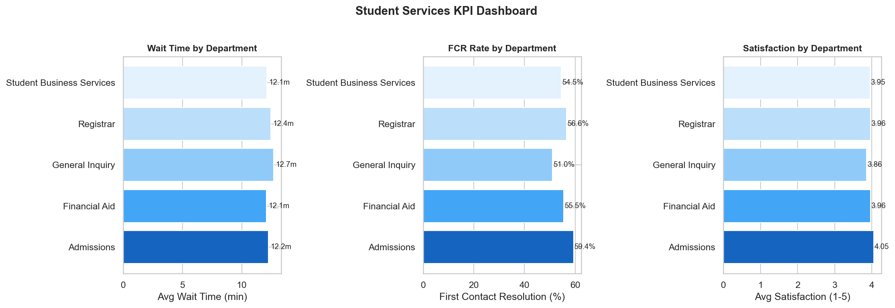
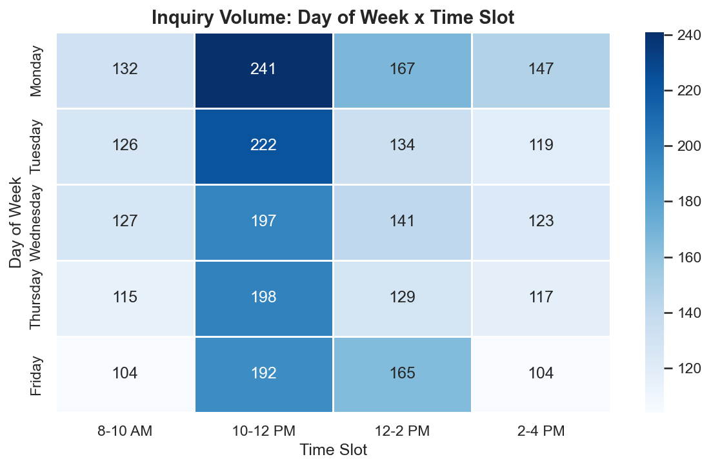
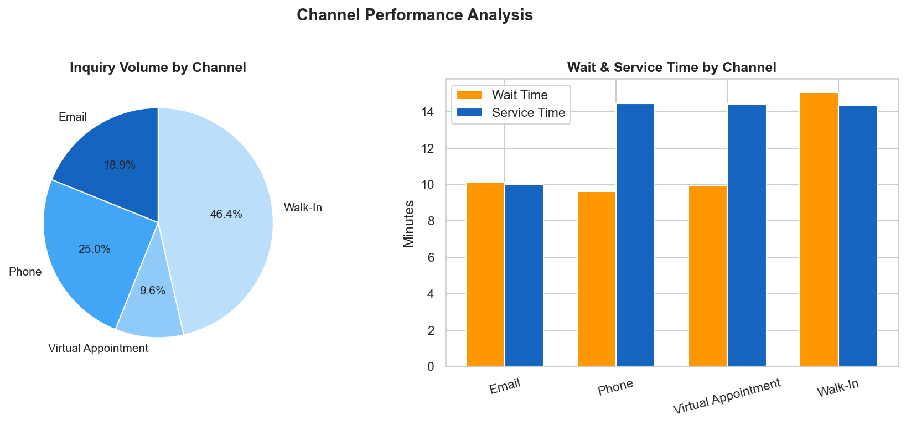
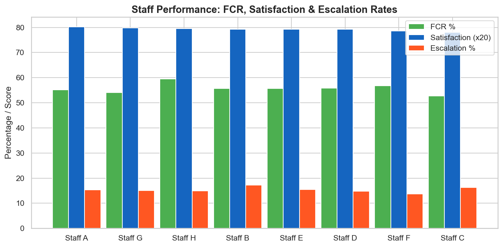
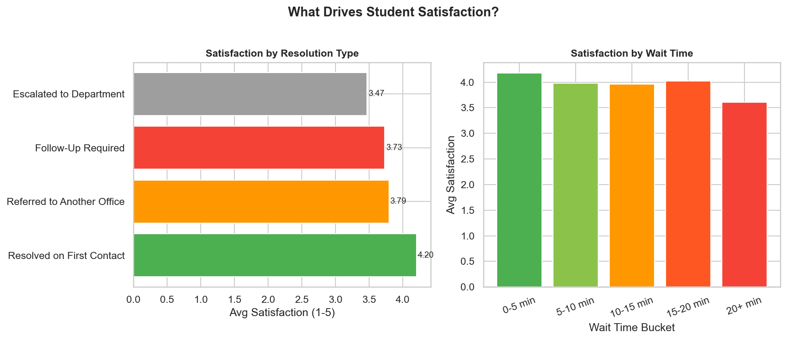

# Student Services Operations Analytics

> Operational analysis of 3,000 student service interactions — KPI tracking, staffing optimization, and satisfaction driver modeling across 4 university departments.


## Business Context

University enrollment centers handle thousands of student interactions across Financial Aid, Registrar, Student Business Services, and Admissions. This project analyzes 3,000 interactions to identify service bottlenecks, optimize staffing, quantify the impact of wait times on satisfaction, and recommend process improvements — applicable to any high-volume customer service operation.

## Dashboards

| | |
|:---:|:---:|
|  |  |
| **Operations KPI Dashboard** | **Volume Patterns & Peak Hours** |
|  |  |
| **Channel Efficiency Analysis** | **Staff Performance Scorecards** |
|  | |
| **Satisfaction Driver Analysis** | |

## Key Findings

| Metric | Value | Insight |
|--------|-------|---------|
| First-Contact Resolution | **55.7%** | Correlates with +0.55 higher satisfaction (p < 0.05) |
| Walk-In Wait Time | **15.1 minutes** | Handles 46% of total volume |
| Peak Period | **Monday 10AM-12PM** | 241 interactions — staffing gap |
| Wait Time Threshold | **>15 minutes** | Significantly reduces satisfaction |
| Escalation Rate | **15.3%** | Training opportunity identified |

## Project Structure

```
student-services-analytics/
├── data/
│   └── student_services_data.csv         # 3,000-row interaction dataset
├── scripts/
│   ├── generate_data.py                  # Simulates student service data
│   └── services_queries.sql              # SQL queries for KPI analysis
├── notebooks/
│   └── services_analysis.py              # Full analysis with statistical tests
├── dashboards/                           # 5 publication-ready visualizations
├── requirements.txt
├── .gitignore
└── README.md
```

## How to Run

```bash
git clone https://github.com/behaldeepanshi01-gif/student-services-analytics.git
cd student-services-analytics
pip install -r requirements.txt
python scripts/generate_data.py
python notebooks/services_analysis.py
```

## Author

**Deepanshi Behal** | [LinkedIn](https://linkedin.com/in/bdeepanshi) | [GitHub](https://github.com/behaldeepanshi01-gif)
